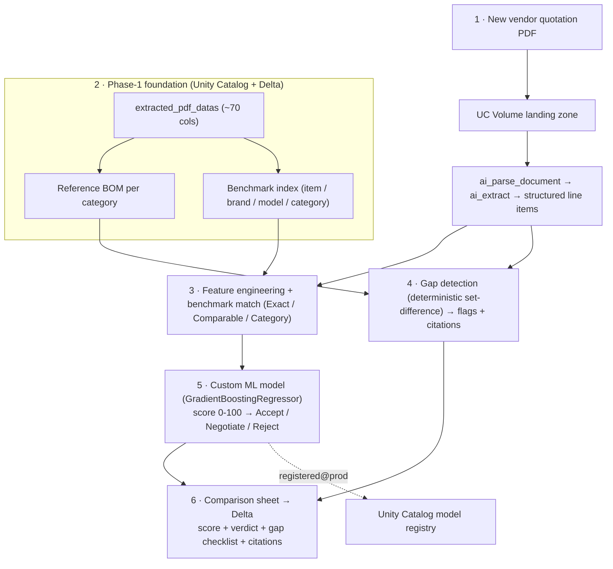

# Kauvery Hospital — CAPEX Phase 2: Procurement Review & Comparison Engine

A self-contained Databricks demo that implements **Phase 2** of the Kauvery CAPEX Procurement
Intelligence Platform: *upload a vendor quotation → is it worth it, what's missing, and how does it
compare to Kauvery's own purchase history?*

It is built around a **custom, retrainable ML model** (scikit-learn + MLflow, registered to Unity
Catalog) — not a read-only Genie/agent — per the customer's stated preference.

## One notebook, one run

Everything installs from a single notebook: [`notebooks/capex_phase2_demo.py`](notebooks/capex_phase2_demo.py).

```
Clone this repo  ->  import the notebook into Databricks  ->  Run all
```

The run creates the historical catalog, derives the reference standard, generates + parses a sample
quotation PDF, trains and registers the ML model, scores the quote, writes a comparison sheet, and
reports evaluation metrics. Typical runtime: **~2–4 minutes on serverless.**

### What it builds

| Object | Description |
|---|---|
| `<catalog>.<schema>.extracted_pdf_datas` | Phase-1 foundation: ~70-column historical PO catalog (synthetic, ~3.2k line items over 2015–2025) |
| `<catalog>.<schema>.quote_comparison_sheets` | Scored comparison sheet for the uploaded quote (verdict + gaps + citations) |
| `<catalog>.<schema>.capex_worth_it` | Custom ML model registered to Unity Catalog, alias `@prod` |
| `/Volumes/<catalog>/<schema>/landing/` | UC Volume landing zone; holds the sample quotation PDF |

## How to run

### Option A — Databricks UI (simplest)
1. Add this repo as a **Git folder** in your Databricks workspace (Repos), or import
   `notebooks/capex_phase2_demo.py` via **Workspace → Import**.
2. Open the notebook, set the widgets at the top if needed (see below), and click **Run all**
   (serverless or any DBR 15.1+ cluster).

### Option B — CLI (serverless job)
```bash
WS="/Workspace/Users/<you>@databricks.com/kauvery-capex-poc"
databricks workspace mkdirs "$WS" --profile <PROFILE>
databricks workspace import "$WS/capex_phase2_demo" \
  --file notebooks/capex_phase2_demo.py --format SOURCE --language PYTHON --overwrite --profile <PROFILE>

databricks jobs submit --no-wait --profile <PROFILE> --json '{
  "run_name": "kauvery-capex-phase2-install",
  "tasks": [{"task_key": "install",
    "notebook_task": {"notebook_path": "'"$WS"'/capex_phase2_demo"},
    "environment_key": "ml_env"}],
  "environments": [{"environment_key": "ml_env",
    "spec": {"client": "4", "dependencies": ["fpdf2", "scikit-learn", "joblib", "mlflow"]}}]
}'
```

### Widgets / configuration
| Widget | Default | Notes |
|---|---|---|
| `catalog` | `kauvey_poc` | **Point this at the customer's real catalog (`purchase_capex_catalog`) to run against real data.** The catalog must already exist (the notebook does not force-create on Default-Storage metastores). |
| `schema` | `gold` | |
| `model_name` | `capex_worth_it` | Registered UC model name |
| `n_pos` | `2200` | Number of synthetic historical POs to generate |

## Architecture / flow



### How the model is built
There are no labeled "worth it" outcomes in the history, so the notebook **synthesizes a training
target** from the customer's weighting rubric (Price 30 · Warranty 15 · AMC/CAMC 15 · Delivery 10 ·
FOC 10 · Historical-frequency 10 · Payment 10) plus realistic noise, then trains a real
`GradientBoostingRegressor` to learn it. When biomedical leads later label ~50 real quotes by actual
post-installation outcomes, swap those in as the target and retrain — the model then improves *past*
the hand-tuned rubric. Scoring/gap logic lives in `capex_scoring.py`, which the notebook writes at
runtime and logs with the model (MLflow "Models from Code").

## Going to the customer's real data
1. Set the `catalog` widget to `purchase_capex_catalog` (and `schema` to `gold`).
2. **Skip Section 2** (synthetic generation) and read the real `extracted_pdf_datas` instead.
3. In Section 5, replace the synthetic target with real labeled outcomes and retrain.

## Data privacy
The only external model calls are Databricks Foundation Model APIs (`ai_parse_document` /
`ai_extract`). Their Llama inference is **hosted inside Databricks** — data does not leave to Meta
and is not used to train the models.

## Not built here (documented future add-ons)
- **FMAPI/Claude open-ended-risk agent** with `get_reference_bom`, `lookup_similar_purchases`,
  `search_contract_clauses`, `compare_line_items` (the BRD's non-deterministic layer).
- **Vector Search** over contract/spec clause text.
- **Databricks App** upload UI + review queue + Excel export.
- **Real-time serving endpoint** (`models:/<model>@prod` is endpoint-ready).
