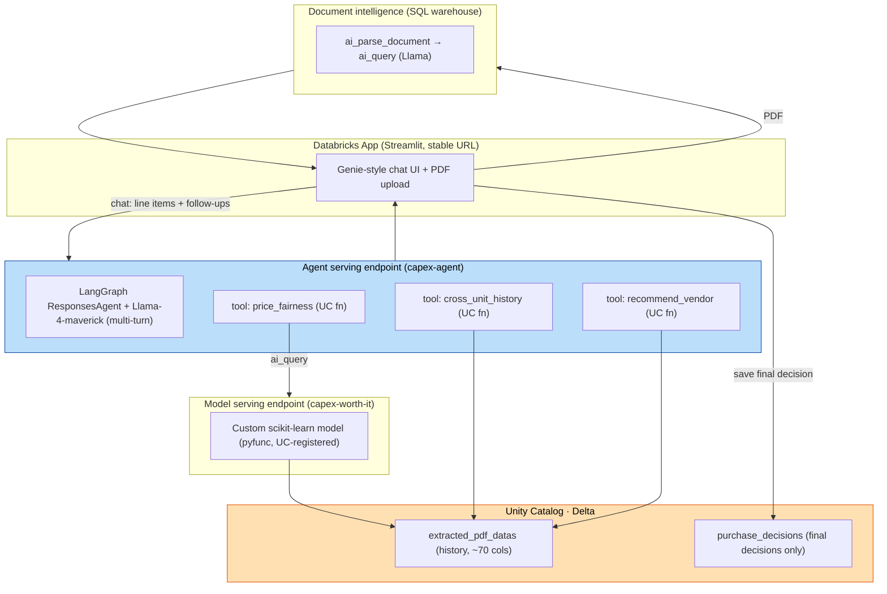

# Kauvery CAPEX — Phase 1: Conversational Quotation Gap-Detection

Architecture, model data-flow, hosting, retention, and training behaviour. Everything runs **inside
Databricks** — no data leaves the environment and no external/vendor model servers are called.

## 1. End-to-end architecture



**The app only ever calls the agent endpoint** (and the SQL warehouse for PDF parsing) — never the raw
model. The agent wraps the model (via the `price_fairness` UC function) plus the two history/vendor
functions, and adds multi-turn conversation.

## 2. The five build steps (from scratch)

| Step | Artifact | Where / how |
|---|---|---|
| 1. Train + register the ML model | `kauvey_poc.gold.capex_worth_it` | `notebooks/capex_phase2_demo.py` (scikit-learn + MLflow → Unity Catalog) |
| 2. Serving endpoint on the model | `capex-worth-it` | `databricks serving-endpoints create` |
| 3. Tools + agent, deployed as its own endpoint | UC functions `price_fairness` / `cross_unit_history` / `recommend_vendor`; agent `capex-agent` | `notebooks/deploy_agent.py` (LangGraph ResponsesAgent → `agents.deploy`) |
| 4. App UI wired to the agent | app `capex-quote-review` | `app/` (Streamlit) → `databricks apps deploy` |
| 5. Add a feature + redeploy | see §6 | URL stays the same |

## 3. Model — what it is, and training behaviour

- **Type:** a custom `GradientBoostingRegressor` (scikit-learn), wrapped as an MLflow `pyfunc` that runs
  benchmark-matching → feature engineering → score → verdict → gap detection. Core logic:
  `src/capex_scoring.py`.
- **Output:** worth-it score 0–100 → **Accept / Negotiate / Reject**, price variance vs the most-recent
  comparable purchase, and a cited gap list.
- **Training target (important):** there are no labelled "worth it" outcomes in the history, so the target
  is **synthesised** from the customer's weighting rubric (price / warranty / AMC-CAMC / delivery / FOC /
  historical-frequency / payment-terms) plus noise. When biomedical leads later label real quotes by actual
  post-installation outcomes, swap those in as the target and retrain — **same pipeline**, and the model
  then improves past the hand-tuned rubric. Weights are a single dict in `src/capex_scoring.py` (`WEIGHTS`).
- **Deterministic:** the model is deterministic; the *agent* on top provides the conversational Q&A.

## 4. Foundation model, hosting & privacy

- **Reasoning model:** `databricks-llama-4-maverick` — a **Databricks-hosted, in-region** Llama foundation
  model. Chosen for strong logical reasoning (ranking/re-ranking) and multi-turn follow-ups. Swappable via
  the `llm_endpoint` widget in `deploy_agent.py` (e.g. to another Llama, or a Databricks-hosted Claude if
  partner models are later accepted).
- **No egress:** the ML model, the agent, and the foundation model all run on Databricks compute in your
  region. Hospital data and PII (purchases 2011–present) never leave the Databricks environment and are
  **not** used to train the foundation models.
- **Auth:** the agent endpoint uses passthrough auth declared via `resources=[...]` at log time (LLM
  endpoint, model endpoint, and the three UC functions). The app authenticates as its own service principal.

## 5. Data handling & retention

- **Quotations are NOT persisted.** Uploaded PDFs land in a UC Volume only for parsing; there is no
  quotation table and **no accept/reject training tables**.
- **Only the final decision is saved** — `kauvey_poc.gold.purchase_decisions` (item, chosen vendor, agreed
  price, rationale, who, when). The app is **write-enabled** (it creates and inserts into this table), so
  future write-backs (e.g. negotiated outcomes) are a small extension.
- **Vendor query letter** (nice-to-have): the "Draft a vendor query letter" button asks the agent to draft a
  letter requesting the missing items — no extra storage.

## 6. Add a feature and re-deploy (URL unchanged)

Databricks Apps keep the **same URL** across redeployments — redeploying updates the app in place.

Example — add a "download comparison as CSV" button:

1. Edit `app/app.py` (add the widget/logic).
2. Re-upload the source and redeploy to the **same app name**:
   ```bash
   SRC="/Workspace/Users/<you>/kauvery-capex-poc/app-src"
   for f in app.py app.yaml requirements.txt; do
     databricks workspace import "$SRC/$f" --file app/$f --format AUTO --overwrite --profile <PROFILE>
   done
   databricks apps deploy capex-quote-review --source-code-path "$SRC" --profile <PROFILE>
   ```
3. The app URL (`https://capex-quote-review-….databricksapps.com`) is unchanged.

For an **agent** change (new tool, new prompt): edit `notebooks/deploy_agent.py`, re-run it — `agents.deploy`
updates the existing `capex-agent` endpoint in place (same endpoint, new version).

## 7. Roadmap

- **Phase 1 (this):** conversational gap-detection app. ✅
- **Phase 2:** risk analytics / TCO — lifecycle cost, AMC/CMC escalation, vendor-concentration (HHI),
  benchmarking percentiles, AI/BI dashboards + alerts.
- **Later:** sizing recommendation — e.g. bed-count sizing for the ~2028 Chennai hospital from historical
  throughput, optionally enriched with government hospital-guideline APIs.

## 8. Credentials

All API tokens/credentials are intentionally left blank — the app and agent use Databricks-managed
service-principal / passthrough auth. Nothing to fill in for in-workspace operation.
