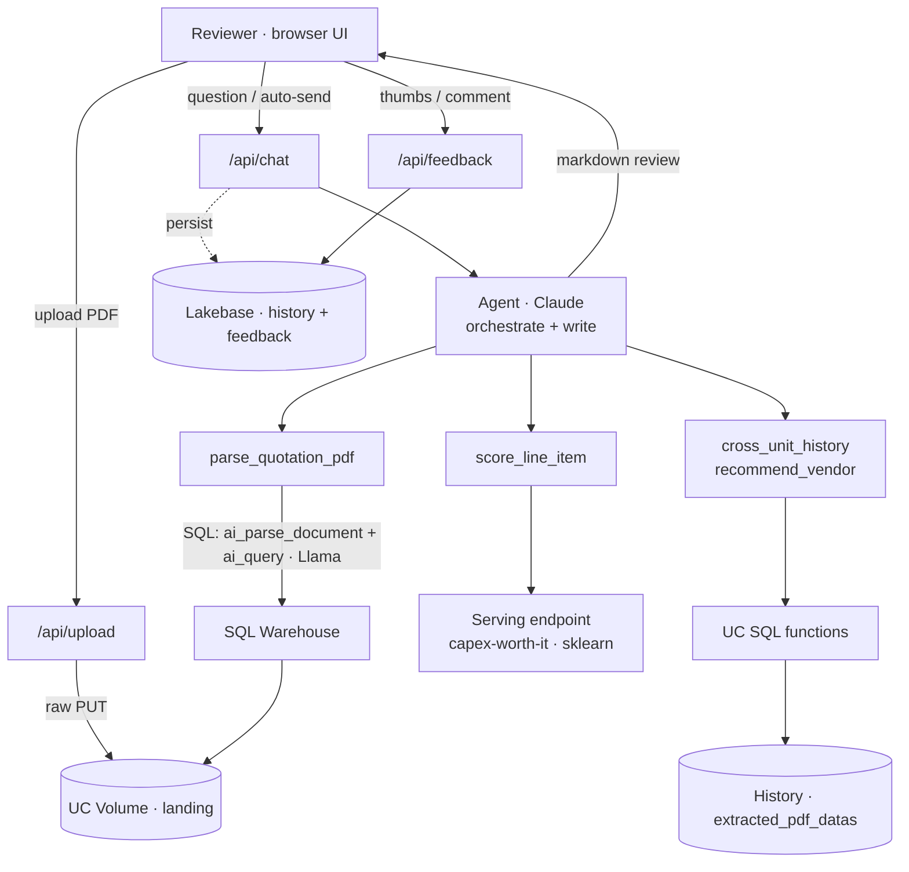

# CAPEX Copilot — Product Requirements (POC)

> An AI assistant that reviews vendor equipment quotations against Kauvery Hospital's own purchase history — price fairness, missing inclusions, cross-site comparison, and a negotiation ask — in seconds.

| | |
|---|---|
| **Customer** | Kauvery Hospital |
| **Platform** | Databricks (Azure) |
| **Status** | POC deployed |
| **Build** | `v2_22` |
| **Date** | 22 Sep 2026 |
| **Owner** | Databricks Scale SE |

---

## 00 · Summary

A procurement reviewer uploads a vendor quotation (PDF or typed). The Copilot extracts the line items, scores each one **0–100** against Kauvery's historical purchases with a custom, retrainable ML model, flags missing inclusions (warranty, AMC/CMC, training, FOC) with citations to real past POs, shows a cheapest-first cross-site price history, recommends the best-value vendor, and drafts a negotiation ask. It runs entirely inside Databricks — the customer's data never leaves the workspace.

## 01 · Problem & context

Kauvery's capital-equipment (CAPEX) purchasing is high-value and judgment-heavy, but quotation review is manual and inconsistent.

Vendor quotes arrive as free-form PDFs in wildly different layouts. Reviewers must judge whether a price is fair, whether the quote is missing standard inclusions, and how it compares to what other Kauvery units paid — largely from memory and scattered spreadsheets. There is no single, grounded reference for "what we normally pay and expect," so negotiating leverage and consistency vary by reviewer.

Kauvery already ingests historical purchase orders into a governed table (`extracted_pdf_datas`, ~8.8k rows across units). **The opportunity:** turn that history into an instant, explainable second opinion on every new quote.

## 02 · Goals & non-goals

**Goals**
- Review any vendor quotation (PDF or typed) in seconds.
- Ground every judgment in Kauvery's *own* history, not generic web knowledge.
- Produce a **consistent, explainable** verdict + price-fairness figure.
- Surface missing inclusions with citations to real POs.
- Recommend the best-value vendor and draft a negotiation ask.
- Keep all data and inference inside the Databricks workspace.
- Be a **retrainable** asset that improves as real outcomes are labeled.

**Non-goals (this POC)**
- Not an ERP / PO-issuing system — it advises, it doesn't purchase.
- No contract-clause NLP / legal risk analysis (future).
- No automated vendor outreach or email.
- Not trained on real "good/bad deal" outcomes yet — see §07.
- No mobile-native app; browser only.

## 03 · Users

| Role | Who | Needs |
|---|---|---|
| **Procurement reviewer** | CAPEX team (primary) | Uploads quotes, reads the verdict + gaps, uses the negotiation ask. Wants a fast, trustworthy second opinion. |
| **Biomedical lead** | Clinical / technical | Validates inclusions (warranty, AMC, training). Later: labels real outcomes to retrain the model. |
| **Admin / program owner** | Oversight | Reviews the feedback Monitor to track quality and adoption. |

## 04 · Solution overview

A hybrid that splits work by strength — **the LLM for language, a custom ML model for the money decision.**

The Copilot deliberately does **not** ask a language model "is this quote worth it?". That number must be deterministic, explainable, governed, and improvable — so it comes from a custom model. The LLM does what it's best at: understanding messy quotes and writing a clear review.

| Component | Role |
|---|---|
| **Claude** — the brain | Orchestrates the review, decides which tools to call, explains gaps, writes the narrative + negotiation strategy. |
| **Llama** — the extractor | Turns an arbitrary-layout PDF into structured line items (the one model that supports `ai_query` JSON output). |
| **scikit-learn** — the scorer | The governed 0–100 worth-score + verdict + deterministic gap detection. Versioned in Unity Catalog, served at low latency. |
| **Your history** — the ground truth | Every price, benchmark, and vendor comes from Kauvery's own POs — never a model's general knowledge. |

## 05 · Functional requirements

| ID | Requirement | Priority |
|---|---|---|
| FR-1 | **Quotation intake** — accept a quote as an uploaded PDF *or* pasted text; uploading auto-starts the review. | Must |
| FR-2 | **PDF extraction** — parse any vendor layout into structured line items (item, brand, model, qty, unit rate, warranty, AMC/FOC, delivery, payment terms). | Must |
| FR-3 | **Worth score & verdict** — score each line item 0–100 → Accept / Negotiate / Reject, with a price-fairness % vs the most-recent comparable purchase. | Must |
| FR-4 | **Gap detection** — flag missing warranty / AMC-CMC / training / installation / FOC, each citing a real historical PO + page. | Must |
| FR-5 | **Cross-unit history** — cheapest-first table of comparable purchases across all Kauvery units. | Must |
| FR-6 | **Vendor recommendation** — rank vendors by value-for-money (bundled FOC + AMC at low price rank highest). | Should |
| FR-7 | **Negotiation ask** — draft an actionable ask to the vendor grounded in the gaps and comparable deals. | Should |
| FR-8 | **New-product handling** — when there is no Kauvery history for an item, say so plainly and review only what the quote provides; never invent a benchmark. | Must |
| FR-9 | **Conversation history** — per-user review history (7-day retention) in the sidebar; reopen a past review. | Should |
| FR-10 | **Feedback + Monitor** — 👍/👎 with an optional comment on each review (idempotent per message); an admin Monitor page lists all feedback. | Should |
| FR-11 | **Error transparency** — if the history DB or scoring model is unreachable, surface the error; never fabricate a benchmark or silently skip it. | Must |

## 06 · Architecture

A single FastAPI process (a Databricks App) serves the UI, exposes the API, and hosts the agent in-process. All tool calls execute as the app **service principal** against the SQL warehouse, the serving endpoint, UC functions, and a UC Volume; history/feedback persist to Lakebase (best-effort).



**Request lifecycle**
1. PDF → `/api/upload` → raw PUT to the Files API → lands in the UC Volume.
2. UI auto-sends `/api/chat` with the volume path; the agent (Claude) runs.
3. Claude calls `parse_quotation_pdf` → warehouse SQL (`ai_parse_document` → `ai_query` with Llama) → line items.
4. Per line item: `score_line_item` → the serving endpoint (the ML model) → score, verdict, gaps.
5. `cross_unit_history` / `recommend_vendor` → UC functions over the history table.
6. Claude composes the markdown review; messages persist to Lakebase.

## 07 · The ML model

A scikit-learn **GradientBoostingRegressor**, wrapped as an MLflow PyFunc, registered in Unity Catalog, and served behind an endpoint. Given one line item, it computes 7 features *relative to Kauvery's history* (price variance vs the most-recent comparable, warranty delta, AMC/FOC presence, delivery, purchase frequency, payment terms), outputs a worth-score 0–100 → verdict, and runs deterministic gap detection with PO citations.

**Trained-model metrics (build `v2_22`)**

| Metric | Value | Meaning |
|---|---|---|
| **MAE** | **3.34** | avg error on the 0–100 score (held-out) |
| **R²** | **0.953** | variance explained |
| **Verdict accuracy** | **87.8%** | Accept/Negotiate/Reject bucket match |

**What drives the score (feature importance)**

| Feature | Importance |
|---|---|
| Price variance vs benchmark | `0.640` |
| Warranty delta (months) | `0.298` |
| AMC / CMC present | `0.039` |
| FOC accessories present | `0.019` |
| Historical frequency | `0.002` |
| Delivery lead days | `0.002` |
| Payment terms | `0.001` |

Price + warranty drive ~94% of the decision — matching Kauvery's stated rubric weights, a good sign the model learned the intended logic. Hyperparameters: 300 trees, depth 3, learning-rate 0.05, 6,000 training rows.

> ⚠️ **What "accuracy" means here — read before quoting these numbers.** There are no real *good-deal / bad-deal* labels yet, so the model is trained on a target **synthesized from Kauvery's rubric** plus noise. The metrics above measure how faithfully it reproduces that rubric — **not** real-world correctness. It is a consistent, explainable POC scorer. Real accuracy is unlocked when biomedical leads label ~30–50 real outcomes (or the 👍/👎 feedback accumulates), the target is swapped, and the model is retrained — at which point it can improve *past* the hand-tuned rubric.

**How to check accuracy in the cx environment:** MAE / R² / verdict-accuracy / gap-recall are logged to an MLflow experiment every training run (Experiments → the `capex_worth_it` run → Metrics). Treat them as a training sanity check until real labels replace the synthetic target.

## 08 · Data & governance

**Required input data** — the whole system depends on a governed history table with these columns (rename to match if needed):

```
<catalog>.<schema>.extracted_pdf_datas
  unit_rate · po_date · model_no · make_brand · po_number · unit_name ·
  warranty_months · amc_value · camc_value · foc_details ·
  special_instructions · source_file_name
```

**Security & governance**
- **Auth:** all tool calls run as the app **service principal**, granted only what it needs — `USE CATALOG/SCHEMA`, `SELECT` on the history table, `EXECUTE` on the functions, `READ/WRITE` on the landing volume, `CAN_QUERY` on the endpoints, `CAN_USE` on the warehouse.
- **Data residency:** extraction and inference use Databricks-hosted Foundation Models — data does not leave the workspace to any external provider.
- **Governance:** the model is a versioned Unity Catalog asset with lineage; the scoring functions are UC-governed SQL.
- **Retention:** quotations are not stored beyond the review; only per-user history (7 days) and the final decision + feedback persist in Lakebase.

## 09 · Success metrics

| Dimension | POC signal | Target as it scales |
|---|---|---|
| Adoption | Reviews run per week | Majority of CAPEX quotes reviewed in-tool |
| Reviewer trust | 👍 rate on the Monitor page | > 80% helpful |
| Speed | Minutes → seconds per quote | Full review < 60s |
| Leverage | Gaps + comparables surfaced per review | Measurable savings on negotiated quotes |
| Model quality | MAE / verdict accuracy (vs rubric) | Retrained on real outcomes; accuracy vs reality |

## 10 · Risks & mitigations

| Risk | Sev | Mitigation |
|---|---|---|
| Service-principal UC grants missing on install → permission errors | **High** | Grant the 8 UC permissions at install (fold into the installer); verify with `SHOW GRANTS`. |
| Lakebase host/endpoint mis-pointed → history silently off | **High** | Set `LAKEBASE_ENDPOINT`/`PGHOST` per env; remove the stale hardcoded default. |
| Extraction FM not available in region (`ai_query` json) | **High** | Preflight-check the FM endpoints; pick a Llama/GPT that exists in the workspace. |
| `extracted_pdf_datas` columns / date format differ | Med | Preflight column + format check; fail loudly with guidance. |
| Model trained on synthetic target, not real outcomes | Med | Set expectations; collect labels via feedback; retrain on real outcomes. |
| SDK version drift (e.g. Files API upload) | Low | Upload via raw Files API PUT (bypasses SDK helper); pin SDK when hardening. |
| Egress / Private Link for the apps domain | Low | Allowlist PyPI + a Private DNS zone for `*.azure.databricksapps.com`. |

## 11 · Roadmap & open questions

**Beyond the POC**
- **Real-outcome labels** → retrain the scorer on actual post-purchase results (the single biggest quality lever).
- **Hardened one-click installer** — auto-grant the SP, derive Lakebase config, preflight FM + data checks.
- **Contract-clause analysis** (Vector Search over spec/contract text) for risks no checklist anticipates.
- **Excel export** of the comparison sheet; review-queue workflow.
- **Admin gating** of the Monitor page if required (currently open to all signed-in users).

**Open questions**
- Who owns labeling real outcomes, and on what cadence?
- Which units/categories to prioritize for the first production rollout?
- Should the negotiation ask be editable/exportable before sending to a vendor?

---

*CAPEX Copilot — Product Requirements (POC) · build `v2_22` · Kauvery Hospital × Databricks · 22 Sep 2026*
